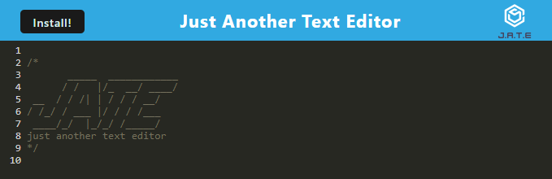

# Text-Editor

## Description

In this challenge, I created a text editor that you can create notes or code snippets with or without an internet connection
so that you can reliably retrieve them for later use.

## Installation

I used visual studio code to create this code.

## Screenshot

##DEPLOYEMENT

https://text-editor-ob92.onrender.com

## Credits

N/A

## License 

Please refer to the LICENSE in the repo.
